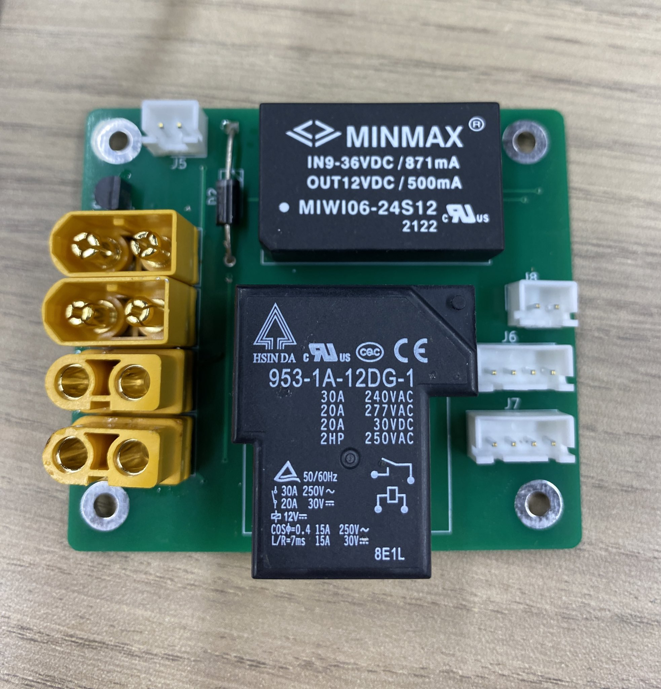

# ハードウェア
 
- 回路図  
 

## 特徴
安いコスト(秋月だけで揃う)．制御系，駆動系の絶縁．高速な駆動電源のスイッチング．

# 端子
### J1 J2
電源入力 絶縁DCDCの関係で`9～36V`の範囲．

### J3 J4
駆動電源出力

### J5
物理緊急停止

### J6 J7
メインバス．絶縁12VとCANパススルー

### J8
遠隔緊急停止  
GPIOと接続して物理緊急停止と直列に駆動電源のスイッチング．
